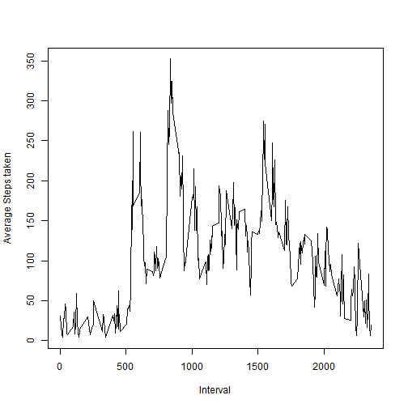

#Reproducible research assignment
#
   
   
**This report is part of the peer assignment 1 for reproducible research, it answers questions by analysing the  activity tracking dataset**

**The numbering and headings used in this report are the same as the numbering and questions as part of the assignment, in order to make the report easy to read and interpret**


###Loading and preprocessing the data

1. Load the data (i.e. read.csv())
2. Process/transform the data (if necessary) into a format suitable for your analysis

```r
data <- read.csv("activity.csv")
datac <- data[complete.cases(data$steps), ]
datav <- datac[which(datac$steps > 0), ]
```


###What is mean total number of steps taken per day?

Ignore the missing values in the dataset

1. Calculate the total number of steps taken per day


```r
datam <- tapply(datav$steps,datav$date,mean)
datas <- tapply(datav$steps,datav$date,sum)
datac <- data.frame(date = rownames(datam), stepsmean = as.vector(datam) )
datasc <- data.frame(date = rownames(datas), stepstotal = as.vector(datas) )
```

2. Make a histogram of the total number of steps taken each day

```r
hist(datasc$stepstotal,main="Histogram of Total Steps per day",xlab="Total Steps")
```

 

3. Calculate and report the mean and median of the total number of steps taken per day

```r
med <- median(datasc$stepstotal, na.rm = TRUE)
men <- mean(datasc$stepstotal, na.rm = TRUE)
```
**The mean is   : 1.0766189 &times; 10<sup>4</sup>**  
**The median is : 10765**

###What is the average daily activity pattern?


```r
datal <- data.frame(steps = datav$steps,interval = factor(datav$interval))
datalm <- tapply(datal$steps,datal$interval,mean)
datals <- data.frame(interval = rownames(datalm), stepsave = as.vector(datalm) )
datalst <- data.frame(interval = as.character(rownames(datalm)), stepsave = as.vector(datalm) )
dtest <- data.frame(interval = as.character(datals$interval),stepsave = datals$stepsave)
#convert factor to character
dtest[] <- lapply(datals, as.character)
```

1. Make a time series plot (i.e. type = "l") of the 5-minute interval (x-axis) and the average number of steps taken, averaged across all days (y-axis)


```r
plot(dtest$interval, dtest$stepsave, type="l", xlab= "Interval", ylab= "Average Steps taken")
```

 

2. Which 5-minute interval, on average across all the days in the dataset, contains the maximum number of steps?


```r
mx <- dtest[which.max(as.numeric(dtest$stepsave)),1]
```

**The interval that contains the maximum number of steps is : 835**

###Imputing missing values

1. Calculate and report the total number of missing values in the dataset (i.e. the total number of rows with NAs)


```r
d <- sum(is.na(data))
```

**The total number of missing values is : 2304**


2. Devise a strategy for filling in all of the missing values in the dataset. The strategy does not need to be sophisticated. For example, you could use the mean/median for that day, or the mean for that 5-minute interval, etc.


**The strategy for imputing missing values is to use the mean for that 5 minute interval**

```r
datacomb <- merge(data,datac,by="date",ALL=TRUE)
datacomb <- merge(data,datac)
datacomb1 <- datacomb
datacomb1$interval <- factor(datacomb1$interval)
datacombf <- merge(datacomb1,datals,by = "interval", all=TRUE)
datacombf$steps <- as.numeric(datacombf$steps)
#Below step is imputing missing values, the missing values is the mean for that interval
datacombf$steps[is.na(datacombf$steps)] <- datacombf$stepsave[is.na(datacombf$steps)]
```

3. Create a new dataset that is equal to the original dataset but with the missing data filled in


**Now again create a histogram with the dataset which has the missing values filled**

```r
datacombft <- tapply(datacombf$steps,datacombf$date,sum)
datacombftc <- data.frame(date = rownames(datacombft), stepsmean = as.vector(datacombft) )
```

4. Make a histogram of the total number of steps taken each day and Calculate and report the mean and median total number of steps taken per day. Do these values differ from the estimates from the first part of the assignment? What is the impact of imputing missing data on the estimates of the total daily number of steps?


```r
hist(datacombftc$stepsmean,main="Histogram of Total Steps per day",xlab="Total Steps")
```

 


```r
medimpute <- median(datacombftc$stepsmean, na.rm = TRUE)
menimpute <- mean(datacombftc$stepsmean, na.rm = TRUE)
```

**The mean after imputing missing values is   : 1.1458 &times; 10<sup>4</sup>**  
**The median after imputing missing values is : 1.3431613 &times; 10<sup>4</sup>**

**After imputing the values, the mean and median have changed (increased)**

